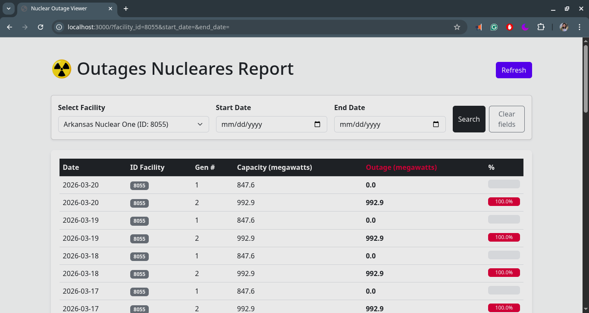

# ☢️ Arkham Technical Challenge

This repository contains the solution for the **Software Engineer** role technical challenge at Arkham. It is a full-stack application designed to monitor, store, and visualize nuclear power plant outages across the U.S.

The first thing I did was check the API page, which included a video about the version 2 update and how to use the API. 
Then, in Postman, I ran a couple of queries to familiarize myself with the API, and subsequently started writing the connection.py script. 
Afterward, I analyzed the "nuclear outage" data, and that's how I created the ER model, which underwent some modifications over time. 
Finally, I implemented the API using FastAPI, and with the same technology and some html with boopstrap style, I set up the web service to display the data.

---
#### directory and explication:

```bash
│arkham_challenge
├── api                     ---> API (part 3 of the challenge)
│   ├── main.py
│   └── 
├── data                   ---> ER Model (part 2 of the challenge)
│   ├── nuclear_outages.db
│   ├── storage.py
│   ├── nuclear outages.png
│   └── test.py
├── connector.py            ---> Connector script (part 1 of the challenge)
├── nuclear_outages.parquet
├── requirements.txt
├── README.md
└── web_app                 ---> Web app (part 4 of the challenge)
    ├── app.py
    └── templates
```
## Quick Start

Follow these steps to get the project running on your local machine.


## API Key setup

### On Linux

```bash
# Create and activate virtual environment
python3 -m venv envy
source envy/bin/activate 
```

### On macOS, you can set the environment variable temporarily for the current session or permanently for all future sessions.

-Temporary (Current Terminal Only)

Open your terminal and run:

```bash
export EIA_API_KEY="your_secret_key_here"
```
-To make it permanent, add the line above to your ~/.bashrc file

### On Windows (PowerShell):

```PowerShell
$env:EIA_API_KEY = "your_secret_key_here"
```
### 1. Environment Setup
Ensure you have **Python 3.10+** installed. We recommend using a virtual environment to keep dependencies isolated.

2. Install dependencies
```bash
pip3 install -r requirements.txt
```

3. Run the Application
The project uses a decoupled architecture, so you need to run two separate processes in different terminals:

-Terminal 1 (Backend API):

```Bash
python api/main.py
```
(Runs on http://localhost:8000. Handles database logic and EIA data processing.)

-Terminal 2 (Frontend Web App):

```bash
python web_app/app.py
```
(Runs on http://localhost:3000. Provides the user interface.)

## Assumptions Made
-The three available API routes for querying data outages have been stored.

-I assumed that since the test was in English, it should be done in English.

-To implement the ER model, it was verified that  "capacity" can increase over time; therefore, the decision was made to store this data in the outage_report table.


##  Result Examples

The interface provides **granular filtering** and **real-time data visualization** for outage analysis.

---

### Filtering Options

#### Filter by Facility
Users can select a specific facility (e.g., `Palo Verde`) from a **dynamic dropdown menu** populated directly from the database.

#### Date Range Selection
Filter outages between custom `start_date` and `end_date` values for precise analysis.

---

### Visual Indicators

| Indicator | Meaning |
|----------|--------|
| **Red Bars** | Critical outages (**> 50% capacity loss**) |
| **Yellow Bars** | Partial outages or scheduled maintenance |

---

### 🔗 API Response Example

```json
{
  "count": 1,
  "data": [
    {
      "report_id": 52,
      "date": "2026-03-20",
      "facility_id": 6022,
      "outage_mw": 1220.1,
      "percent": 100.0
    }
  ]
}
```


